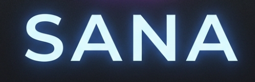

# SANA - AI Mental Health Companion

A compassionate AI-powered mental health support platform featuring a 3D avatar companion, real-time video consultations, peer support forums, and intelligent conversation powered by **Groq's llama-3.3-70b**.



## 🌟 Features in Detail

### Advanced AI Core (RAG & Groq)
- **Knowledge-Grounded Responses**: Utilizes **Retrieval-Augmented Generation (RAG)** to provide accurate, therapeutically relevant information from a curated knowledge base.
- **Ultra-Fast Inference**: Powered by **Groq's llama-3.3-70b-versatile**, ensuring conversational fluidity with sub-second latency.
- **Contextual Awareness**: Maintains session history to provide personalized and continuous support.

### Immersive 3D Companion (Ziva)
- **Interactive Presence**: A fully 3D avatar that listens and responds in real-time.
- **Lip-Sync & Animation**: Powered by **Viseme analysis** for realistic speech-to-facial-movement synchronization.
- **Hands-Free Interaction**: Integrated **Voice Activity Detection (VAD)** allows for seamless, button-free conversation with auto-start and auto-timeout.

### Proactive Care System
- **Weekly Check-ins**: SANA proactively initiates weekly mental health check-ins to track progress over time.
- **Smart Reminders**: Intelligent nudges based on user activity and scheduled goals.
- **Adaptive Questioning**: Check-in questions evolve based on previous responses and current state.

### Secure Authentication & User Management
- **Safe & Secure**: Full JWT-based authentication system for secure login and registration.
- **Profile Management**: Manage personal details, medical history, and user preferences.
- **Session Privacy**: Chat histories and personal data are protected and user-scoped.

### Smart Appointment Booking
- **Doctor Discovery**: Browse available mental health professionals.
- **Scheduling System**: Integrated booking interface to schedule appointments with doctors.
- **Appointment Management**: View upcoming and past appointments in a dedicated dashboard.

### Telehealth Video Consultations
- **HD Video Calls**: Built on **WebRTC** for high-quality, peer-to-peer video sessions.
- **In-Call Tools**: Mute, camera toggle, and screen sharing capabilities (in progress).
- **Secure Connection**: Direct P2P connection ensures conversation privacy.

### Anonymous Peer Support
- **Safe Community**: A judgment-free forum for users to share experiences and advice.
- **Categorized Discussions**: Topic-based threads for specific mental health areas (anxiety, depression, mindfulness).
- **Moderation**: (Planned) AI-assisted moderation to ensure community safety.

###  Wellness Dashboard
- **Insights**: Visual representation of session frequency and mood trends.
- **Activity Tracking**: Monitor engagement with the platform to encourage consistent self-care.

---

## Tech Stack

### Frontend
- **React 18** with TypeScript
- **Vite** for fast development
- **Three.js** / **React Three Fiber** for 3D avatar
- **Tailwind CSS** for styling
- **WebRTC** for video calls
- **React Router** for navigation
- **VAD (Voice Activity Detection)** for hands-free audio

### Backend
- **FastAPI** (Python)
- **LangChain** / **RAG** for knowledge retrieval
- **Groq** (llama-3.3-70b-versatile) for LLM
- **Whisper** (OpenAI) for speech-to-text
- **Edge TTS** for high-quality, ultra-low latency text-to-speech
- **JWT** (JSON Web Tokens) for authentication
- **MongoDB** (Motor async driver) for data persistence

---

## Prerequisites

- **Node.js** 18+
- **Python** 3.10+ (Recommended)
- **Groq API Key** (Required for LLM)

---
## Architecture
- **detailed architecture diagram**: [ARCHITECTURE_DIAGRAM_PROMPT.md](ARCHITECTURE_DIAGRAM_PROMPT.md)

---

## 📁 Project Structure

```
SANA/
├── Backend/
│   ├── main.py              # FastAPI server entry point
│   ├── auth.py              # Authentication logic
│   ├── rag/                 # RAG (Retrieval Augmented Generation) System
│   │   ├── rag_chain.py     # LangChain logic
│   │   ├── rag_retriever.py # Knowledge retrieval
│   │   └── knowledge_data/  # Source documents
│   ├── routes/              # API Endpoints (Auth, Chat, Doctors, Forum)
│   ├── services/            # Business logic
│   ├── requirements.txt     # Python dependencies
│   └── .env                 # API Keys & Config
│
├── Frontend/
│   ├── src/
│   │   ├── pages/
│   │   │   ├── LandingPage.tsx   # Hero section & Intro
│   │   │   ├── Login.tsx         # Authentication
│   │   │   ├── Register.tsx      # User Signup
│   │   │   ├── LiveSession.tsx   # 3D Avatar chat interface
│   │   │   ├── DoctorConnect.tsx # Video call portal
│   │   │   ├── BookingPage.tsx   # Appointment scheduling
│   │   │   ├── PeerSupport.tsx   # Community forum
│   │   │   └── Profile.tsx       # User dashboard
│   │   ├── components/       # Reusable UI components
│   │   ├── services/         # API & WebRTC services
│   │   └── App.tsx           # Main React component
│   └── vite.config.ts
│
├── .gitignore
└── README.md
```

---

## 🎨 Design Philosophy: "Ethereal Sanctuary"

SANA features a completely redesigned user interface known as **"Ethereal Sanctuary"**. This premium design language focuses on creating a safe, calming, yet highly professional environment for mental health support.

- **Glassmorphism Spec**: Extensive use of frosted glass effects (`backdrop-blur`), translucent layers, and subtle borders to create depth and hierarchy without heaviness.
- **Deep Ambient Aesthetics**: A rich, deep color palette (`sana-navy` to `slate-900`) paired with vibrant accent gradients (`sana-gradient`) to evoke a sense of calm and modern sophistication.
- **Micro-Interactions**: Smooth CSS transitions, fade-in animations, and interactive hover states make the application feel alive and responsive.
- **Premium Typography**: Utilization of display fonts for headers (`h1-display`) and clean sans-serif bodies for maximum readability.
- **Consistent Visual Identity**: A unified design system using custom Tailwind components (`glass-panel`, `glass-button`, `glass-input`) across all pages.

---

<!-- ## 🔐 Environment Variables

Create a `.env` file in the `Backend/` directory:

```env
GROQ_API_KEY=your_groq_api_key_here
MONGO_DETAILS=your_mongodb_connection_string
DB_NAME=your_database_name
``` -->

---

## 🧪 Features in Development

- [ ] Real signaling server for WebRTC (currently mock/P2P)
- [ ] Mood tracking analytics (Advanced AI sentiment analysis)
- [ ] Professional therapist integration (Onboarding portal)
- [ ] Multi-language support (i18n)
- [ ] Mobile App (React Native)

---

## 🤝 Contributing

Contributions are welcome! Please follow these guidelines:

1. Fork the repository
2. Create a feature branch (`git checkout -b feature/AmazingFeature`)
3. Commit your changes (`git commit -m 'Add some AmazingFeature'`)
4. Push to the branch (`git push origin feature/AmazingFeature`)
5. Open a Pull Request

---

## 📄 License

This project is licensed under the MIT License - see the [LICENSE](LICENSE) file for details.

---

## 🙏 Acknowledgments

- **Groq** for ultra-fast LLM inference
- **Three.js** / **Ready Player Me** for 3D avatar technology
- **FastAPI** for the robust backend framework
- **React Three Fiber** for 3D in React
- **Tailwind CSS** for the powerful styling engine

---

SANA is a support tool, not a replacement for professional mental health care.

---

## 📧 Contact

For questions or support, please open an issue on GitHub also you can contact me on my linkedin profile **[Kaushal-Jindal](https://www.linkedin.com/in/kaushal-jindal/)**.

---

**Developed with 💙 by [Kaushal Jindal](https://github.com/kaushaljindall)**

